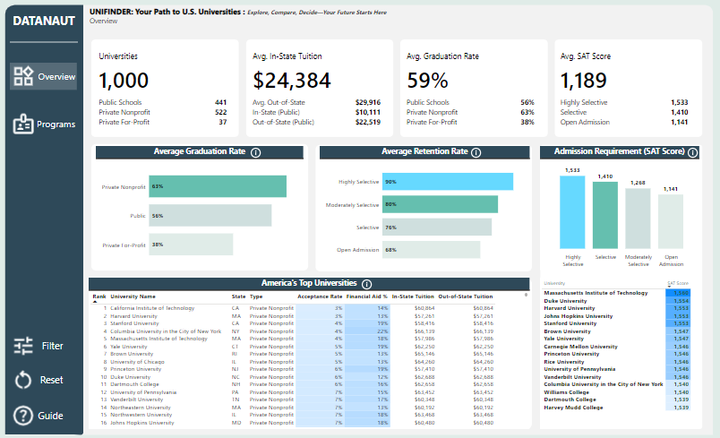

# UniFinder: Your Path to U.S. Universities

**Tagline:** *Explore, Compare, Decide—Your Future Starts Here*

## Overview
UniFinder is a Power BI dashboard designed to help prospective students, parents, and education analysts explore and evaluate U.S. universities. It provides interactive visualizations and rankings based on key metrics like tuition costs, acceptance rates, graduation rates, and program details, sourced from a Snowflake data warehouse. The dashboard is split into two main pages: **Overview** and **Program Details**, offering a comprehensive tool for educational decision-making.

---

## Features
- **Overview Page**:
  - Quick metrics via cards (e.g., Total Universities, Avg. Tuition).
  - Charts for Graduation rate by school type, Retention vs selectivity and selectivity distribution.
  - Dynamic university ranking table.
  - Admission requirements summary.

- **Program Details Page**:
  - Program-focused metrics (e.g., Total Programs, Avg. Credit Hours).
  - Charts for top departments and program levels by school type.
  - Detailed course table with tuition and financial aid insights.

- **Interactivity**: Slicers for filtering by state, school type, and more.
- **Custom Tooltips**: Enhanced visuals with explanations for graduation, retention, SAT scores, and top universities.
- **Data Quality**: Handles missing data (e.g., 0s in SAT scores) with DAX measures excluding invalid values.

---

## Installation
1. **Prerequisites**:
   - Power BI Desktop (latest version recommended).
   - Access to a Snowflake data warehouse with the required schema.

2. **Setup**:
   - Clone this repository:
     ```bash
     git clone https://github.com/Manny-97/dec-hackathon.git
     ```
   - Open `America’s Top Universities Analytics Dashboard.pbix` in Power BI Desktop.
   - Update the data source connection to your Snowflake warehouse:
     - Go to **Home > Transform Data > Data Source Settings**.
     - Enter your Snowflake credentials and database details.

3. **Refresh Data**:
   - Click **Refresh** to load the latest data from Snowflake.

4. **View and Interact with Dashboard on web**: [UniFinder Dashboard](https://app.powerbi.com/view?r=eyJrIjoiZWUyYzljNmMtM2FjMS00ZjllLWIwNjUtMzdjMjRlMjI4ZmRmIiwidCI6IjQzOGFiNWNlLTljODEtNDI0Ni05Yjk4LTI5ZmY3YWQ3ZDBhOSJ9) 

---

## Usage
- **Launch**: Open `America’s Top Universities Analytics Dashboard.pbix` in Power BI Desktop.
- **Navigate**:
  - Use the sidebar to switch between **Overview** and **Program Details**.
  - Click **Filters** to apply slicers (e.g., state, school type).
- **Interact**:
  - Hover over charts for custom tooltips.
  - Sort the ranking table by clicking column headers.
- **Reset**: Use the **Reset** button to clear filters.

---

## Data Sources
- **Snowflake Warehouse**: **Schema Details**: See `schema.md` (optional separate file) for full structure.

---
### Dataset Refresh Schedule

The Power BI Dashboard is configured to automatically refresh its dataset using the import connection to Snowflake. The scheduled refresh runs **twice a week**:
- **Sunday at 1:00 AM** (local time)
- **Wednesday at 1:00 AM** (local time)

---

## Screenshots
### Overview Page

*Quick metrics, charts, and rankings for a broad university overview.*

### Program Details Page

*Program-specific insights with course details and financial context.*

---

## Data Handling
- **Missing Values**: 0s in metrics (e.g., 380/1000 universities with 0 SAT scores) are kept intact and excluded from averages , these mising values were replaced with `Not Reported` in metric display columns for Table visuals

Categories: Acceptance rates categorized in Power Query (e.g., "Highly Selective" ≤10%).
---
